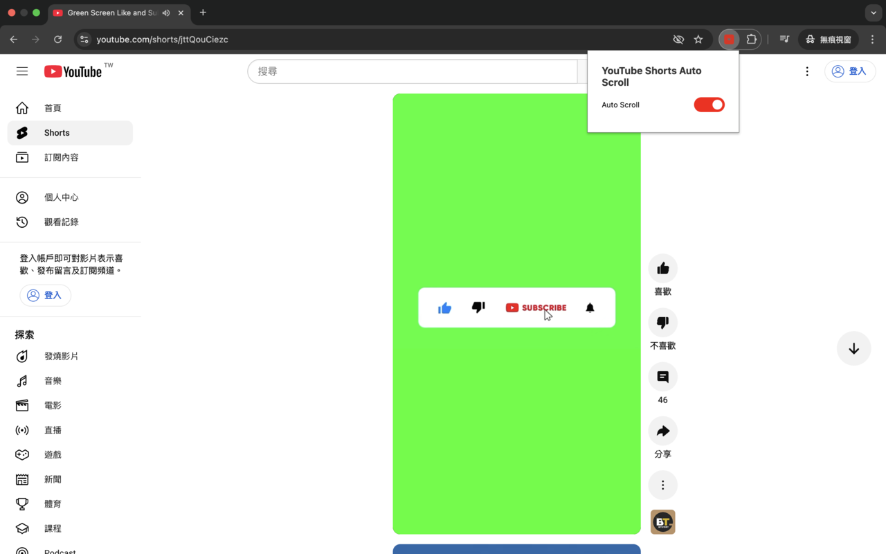

#  YouTube Shorts Auto Scroll

A browser extension that automatically scrolls to the next YouTube Shorts video when the current one ends.

## Install

### Chrome/Edge

1. Open Chrome/Edge and go to [chrome://extensions](chrome://extensions) or [edge://extensions](edge://extensions)
2. Search for "YouTube Shorts Auto Scroll"
3. Click "Add extension"

## Demo

